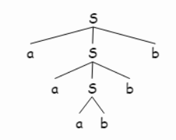
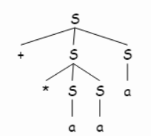
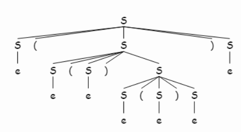

### 4.2.1 
Consider the context-free grammar $$ S \rightarrow SS+ \ | \ SS* \ | \ a$$ and the string $aa+a*$.

#### a) Give a leftmost derivation for the string
```
S 
SS*
SS+ S *
aS+ S *
aa+ S *
aa+ a *
```

#### b) Give a rightmost derivation for the string
```
S 
SS*
Sa*
SS+ a*
Sa+ a*
aa+ a*
```

#### c) Give a parse tree for the string


#### d) Is the grammar ambiguous or unambiguous? Justify your answer

This grammar is unambiguous. In the process of rightmost derivation,
We can use the last symbol to determine which derivation to use among three of them. The possible symbols are $\{+, *, a\}$

#### e) Describe the language generated by this grammar

The set of postfix expressions, which has $+, *$ as operators and has $a$ as ?.

---

### 4.2.2

Repeat Exercise 4.2.1 for each of the following grammars and strings

#### a) $S \rightarrow 0S1 \ | \ 01$ with string $000111$

1.
2.
```
-- lm and rm derivations are same
S
0S1
00S11
000111
```
3.

(a,b) = (0,1)  <br> 

4. unambiguous  <br>
We can always determine which derivation should be applied based on the length of the input symbols

5. $S = {0^n1^n \ | \ n \ge 1}$

#### b) $S \rightarrow +SS \ | \ *SS \ | \ a$ with string $+*aaa$

1.
2.
```
<lm>
S
+SS
+ *SS S
+ *aS S
+ *aa S
+ *aa a

<rm>
S
+SS
+S a
+ *SS a
+ *Sa a
+ *aa a
```
3.
<br>

4. Unambiguous

Based on the First Input Symbol. (It's ```LR(1)``` grammar)

5. The set of prefix expressions having $+, *$ as operators

#### c) $S \rightarrow S(S)S \ | \ \epsilon$ with string $(()())$



Ambiguous


### 4.2.3

Design grammars for the following languages

#### a) The set of all strings of 0s and 1s such that every 0 is immediately followed by at least 1

$
<A> \Coloneqq 0?1 \\
<S> \Coloneqq <A>\{<A>\}
$


#### b) The set of all strings of 0s and 1s that are palindromes; that is, the string reads the same backward as forward.

$
<S> \Coloneqq  
0S0 \ | \ 1S1 \ | \ 0 \ | \ 1 \ | \ \epsilon
$

#### c) The set of all strings of 0s and 1s with an equal number of 0s and 1s.

$
<S> \Coloneqq 0S1S \ | \ 1S0S \ | \ \epsilon  
$  <br>
It's ambiguous, how to resolve,,?

#### d) The set of all strings of 0s and 1s with an unequal number of 0s and 1s.


#### e) The set of all strings of 0s and as in which 011 does not appear as a substring.

$
<S> \Coloneqq \{1\}\{(0 \ | \ (01))\}
$

#### f) The set of all strings of 0s and 1s of the form xy, where x<>y and x and y are of the same length.


### 4.2.4

$
<A> \Coloneqq X[Y]Z
$<Br><Br>
$
<A> \Coloneqq XYZ \ | XZ
$
<br><Br><br>
$
<A> \Coloneqq X\{YZ\}
$<br><br>
$
<A> \Coloneqq X<B>\\
<B> \Coloneqq <B>\{YZ\} \ | \ \epsilon
$

### 4.2.5

```
<stmt> ::= if (<expr> | <stmt>) then stmt [else <stmt>]
         | begin <stmtList> end

<stmtList> ::= <stmt>{; <stmt>}
```


