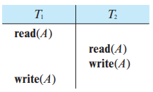

### 17.8

The <b>lost update anomaly</b> is said to occur if a transaction $T
_j$ reads a data item, then another transaction $T_k$ writes the data item (possibly based on a previous read), after which $T_j$ writes the data item. The update performed by $T_k$ has been lost, since the update done by $T_j$ ignored the value written by $T_k$

---

#### a. Give an example of a schedule showing the lost update anomaly.

#### b. Give an example schedule to show that the lost update anomaly is possible with the <u>read commmitted</u> isolation level.

#### c. Explain why the lost update anomaly is not possible with the <u>repeatable read</u> isolation level